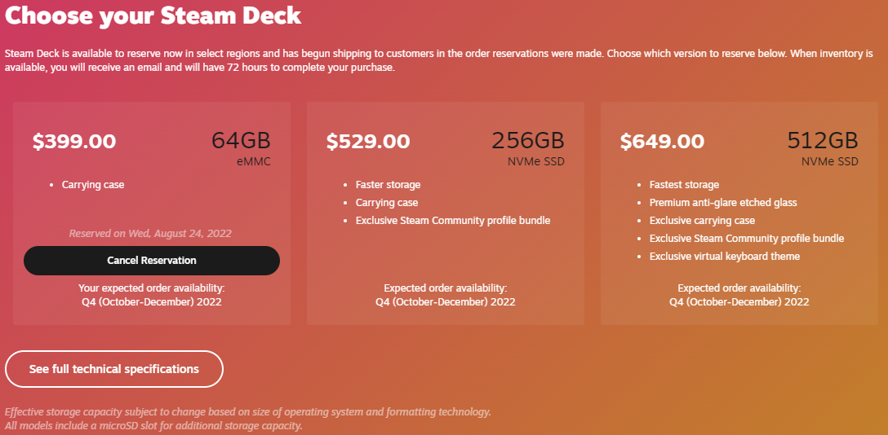

# Reservations

!> :construction: This page is **under construction**, expect frequent major
updates and corrections until this banner is removed. :construction:

_Q: I just submitted my reservation, what's next?_  
A: Reservations are fulfilled in the order they are received. That said, Valve
has
[increased Steam Deck deliveries](https://twitter.com/OnDeck/status/1541459263444332544)
exponentially and rumored to have all orders fulfilled within 2022.

Keep in mind, until this point Valve has tended to ship in large chunked
shipments so it is common to hear nothing at all then all of a sudden many
people received their Steam Deck in a short span of time.

## What Q am I in?

After reserving, if you visit the
[Steam Deck Reservation Page](https://store.steampowered.com/steamdeck) it will
show your reservation details under the chosen Steam Deck.

Below the "Cancel Reservation" button shows your Quarter. Example:

> Your expected order availability:  
> Q4 (October-December) 2022

In this example, this would mean you are in Q4 2022.

## Being Notified

> When your Steam Deck is ready, you will be notified via email and a banner
> within Steam itself.

Once your reservation becomes available, you have a two day window to purchase
your Steam Deck. Once this window is open for you, you will receive an email as
well as a prominent popup within Steam itself notifying you.

Although a banner is prominently shown in Steam, you will not receive a
notification via the Steam phone app.

A huge shout out to [this generous imgur post](https://imgur.com/a/7Brnab8)
which shows all of the ways you will be notified when your Steam Deck is
available.
[Here](https://www.reddit.com/r/SteamDeck/comments/ugupfd/all_the_ways_steam_will_notify_you_that_its_your/)
is a reddit thread with additional discussions where users ask additional
questions.

As a preservation effort, a request has been made to u/wateranddiamonds to
create a direct copy of the imgur post here.

## Shipping

So far, most users have reported getting their Steam Deck via FedEx. The time
frame takes anywhere from one to two weeks from the day the purchase has been
made to having the Steam Deck in hand. As a personal anecdote, it took me a week
and 4 days between payment and receiving my deck.

There are of course exceptions to this.

## Preparing for arrival

Due to the high demand, it can be difficult even to purchase 3rd party
accessories for the Steam Deck. For this reason, I highly recommend purchasing
accessorizing

Although we aspire to provide a complete picture, you may want to check out the
[resources](resources.md) page for external links that can be helpful to learn
more about the deck. Another place you may want to check is the
[accessories](../accessories.md) page to see which accessories you may want to
purchase when you get your Steam Deck.

## Deck delivery prediction tools

Due to the burst nature of Steam Deck deliveries, some of these tools haven't
been the most accurate. That combined with the fact that Valve has been
readjusting delivery schedules, I recommend proceeding with caution.

That said, here are the known delivery prediction tools

1. [Steam Deck Shipment estimator](https://docs.google.com/forms/d/e/1FAIpQLSfLZaRMIVknUubuHjhfXU_x6VEAifId-n7rIhi6DVTPTcLWNw/viewform)
   [data spreadsheet](https://docs.google.com/spreadsheets/d/1QqlSUpqhyBCBYeu_gW4w5vIxfcd7qablSviALDFJ0Dg/edit#gid=1651884584)
2. [Steam Deck Calculator (archived)][https://steam-deck-calculator.web.app/]
   [github](https://github.com/moonag/steam-deck-calculator)
