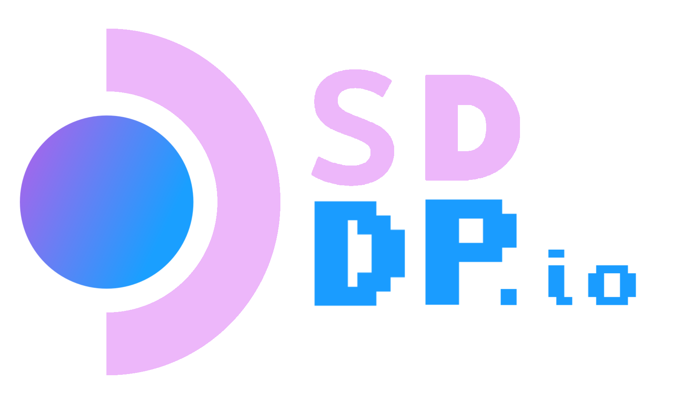

# About

!> :construction: This page is **under construction**, expect frequent major
updates and corrections until this banner is removed. :construction:

sddp.io aims to be:

- Collaborative
- A "one stop shop" for all vital Steam Deck technical information
- As concise as practical
- Beginner friendly, but also expert friendly
- A path to mastery for those who choose to take it

> If you believe in the mission of sddp.io please consider becoming a
> collaborator. We need experts and newbies alike. If you find something to be
> confusing or think something is missing then
> [open an issue](https://github.com/chadbailey/sddp.io/issues).
>
> My guarantee to you is that you will never be rejected or made fun of for your
> honest feedback. Anyone who engages in such behavior will be handled promptly.
