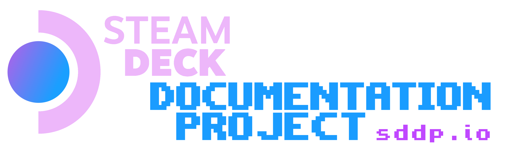

# The SDDP Advantage

- Trustworthy
- Collaborative
- Follows best practices
- Reduces rework
- Concise
- Deep domain expertise

The Steam Deck Documentation Project is ran by a Software Engineer and Linux
enthusiast with 24 years of (hobbyist) Linux experience. For this reason,
everything you find here has been vetted to ensure the solutions are safe and
follow best practices.

With an industry that moves as fast as this, only the fast and nimble survive.
This means there's no such thing as being perfect. For this reason SDDP does not
rely upon perfection, but collaboration to deliver the highest quality advice
and solutions possible.
